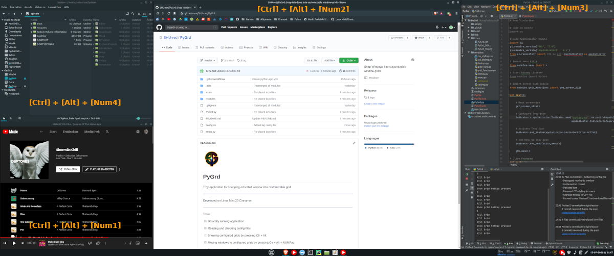
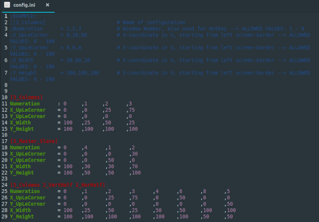
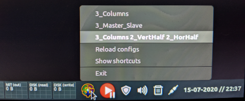

# PyGrd
<p align="center">
  <br>
  <b>PyGrd</b><br>
  <br>
  Tray-application for snapping activated window into customizable grid<br>
  The perfect solution if you've got super-widescreen monitors for example!
</p>
  
<p align="center">
  <b>Windows are moved and resized immediately to configuratable grid-tiles</b><br>
  <br>
  <br>
  <br>
  <b>Easy configuration via percentual declaration</b><br>
  <br>
  <br>
  <b>Easy configuration picking via TrayIcon</b><br>
  
</p>

***
## Development
- Developed & tested on Linux Mint 20 Cinnamon
- Developed & testen on Python 3.8
- Has to be ran as root due to handling of tray-icon
***
## How to run
Only tested on Linux Mint 20 Cinnamon
- Modules are used requiring root (Gtk, Gdk, Tkinter, Xlib, ...)
- To run applications as root without terminal-commands or passwords > systemd-services are used
- For using systemd-services see documentation or tutorials (like [this one](https://forums.linuxmint.com/viewtopic.php?t=275464))

Here's the script i use as pygrd.service:
(placed at /etc/systemd/system/)
```
[Unit]
Description=PyGrd

[Service]
User=usr
Group=nogroup
Type=simple
WorkingDirectory=/home/usr/PycharmProjects/PyGrd
ExecStart=+/home/usr/PycharmProjects/PyGrd/PyGrd.py
Restart=always
RestartSec=3
Environment=DISPLAY=:0

[Install]
WantedBy=multi-user.target
```
Important settings:
- User=usr is used for permissions
- WorkingDirectory is used for relative paths to work
- "plus" at the beginning of ExecStart also is used for permissions
- Restart and RestartSec is very important to keep the script always trying until display-informations are available during boot-process
- Environment is also needed for the script not to crash in early-boot-phase
***
## Constraints
- Not tested with multiple displays (useful for extra-wide-screens) > Feel free to request multi-display compatibility
- Only tested with Linux Mint 20 Cinnamon
- Until now only available for python 3.8 > Maybe executable binaries will occure in future

But thats it!

Enjoy and give feedb3ack!
