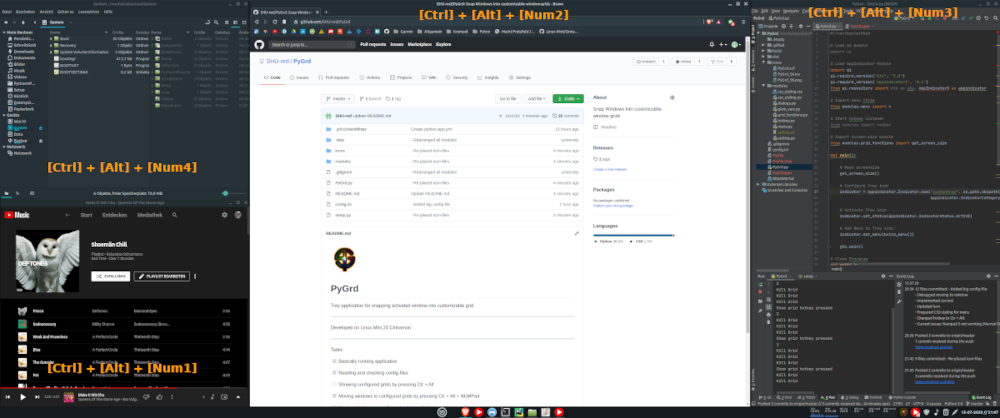

# PyGrd

   
  <b>PyGrd</b> 
   
  Tray-application for snapping activated window into customizable grid

  

  <b>Windows are moved and resized immediately to configuratable grid-tiles</b> 
   
   
  <b>Easy configuration via percentual declaration</b> 
   
   
  <b>Easy configuration picking via TrayIcon</b> 
  

***
## How to run
- Developed & tested on Linux Mint 20 Cinnamon
- Developed & testen on Python 3.8
- Has to be ran as root due to handling of tray-icon
***
## Tasks
- [x] Basically running application
- [x] Reading and checking config-files
- [ ] Showing configured grids by pressing Ctr + Alt
- [x] Moving windows to configured grids by pressing Ctr + Alt + NUMPad
- [ ] Moving windows to configured grids by clicking on grid

- [ ] Styling
- [ ] Documentation
